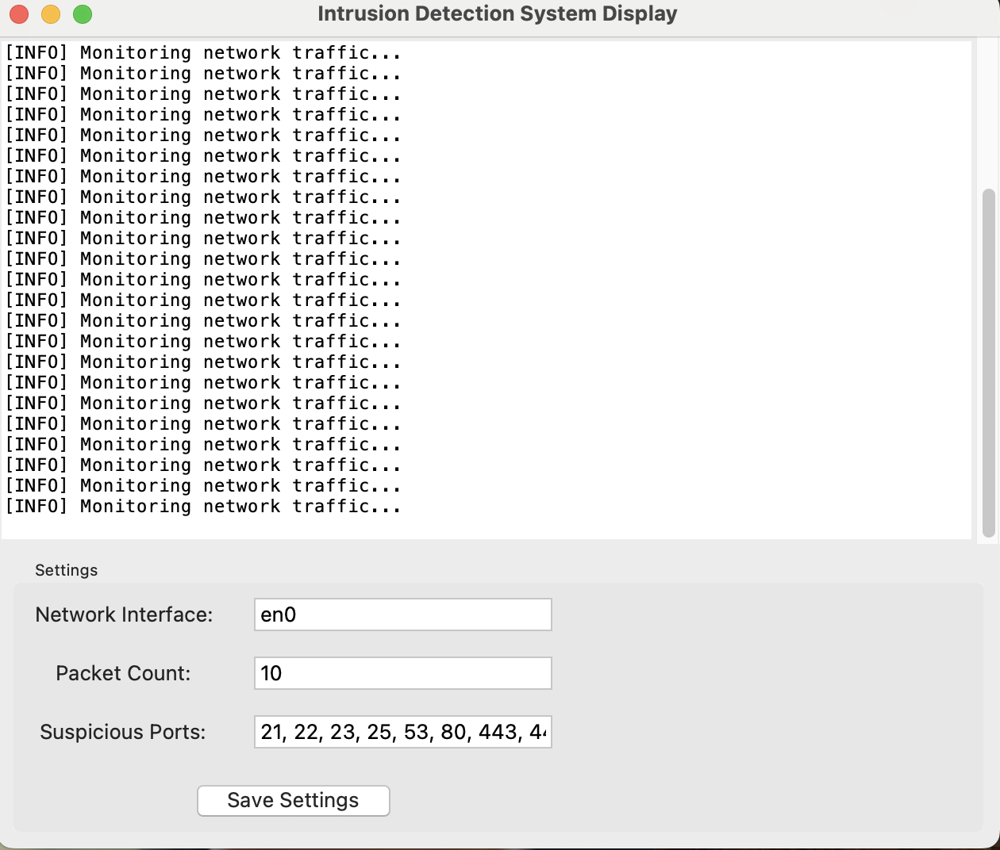

[](https://opensource.org/licenses/MIT)
[](https://www.python.org/downloads/)
[](https://github.com/your-username/ids/actions)

<div align="center">
   
</div>

# Simple Intrusion Detection System (IDS)

A lightweight Python-based Intrusion Detection System that monitors network traffic, system logs, and port scanning activities to detect potential security threats.

## Features

- Network packet monitoring and analysis
- Port scan detection
- System log monitoring
- Customizable alert thresholds
- Real-time alerts and logging
- Graphical User Interface (GUI) for configuration and display

## Screenshot



## Requirements

- Python 3.8+
- Required packages listed in `requirements.txt`

## Installation

1. Clone this repository
2. Install dependencies:
   ```
   pip install -r requirements.txt
   ```

## Usage

### Running the IDS Application

Run the main IDS application:

```
python ids.py
```

To customize configurations using the GUI, run:

```
python ids_gui.py
```

For specific monitoring modules:

```
python network_monitor.py  # Network traffic monitoring only
python port_scanner.py     # Port scan detection only
python log_monitor.py      # System log monitoring only
```

## Configuration

Edit `config.py` to customize detection thresholds, monitored ports, and alert settings. The GUI also allows for real-time updates to these configurations.

1. **Network Settings**: Modify the network interface, packet count, and suspicious ports.
2. **System Settings**: Adjust CPU, memory, and disk usage thresholds.
3. **Log Settings**: Specify log files and patterns to monitor.
4. Click "Save" to apply changes.

### Displaying IDS Information

To display real-time IDS information, run:

```
python ids_gui_display.py
```

This will open a window that shows logs and alerts generated by the IDS.

## Note

This is a simple IDS for educational purposes. For production environments, consider using established security solutions.

## License

This project is released under the [MIT License](https://opensource.org/licenses/MIT).